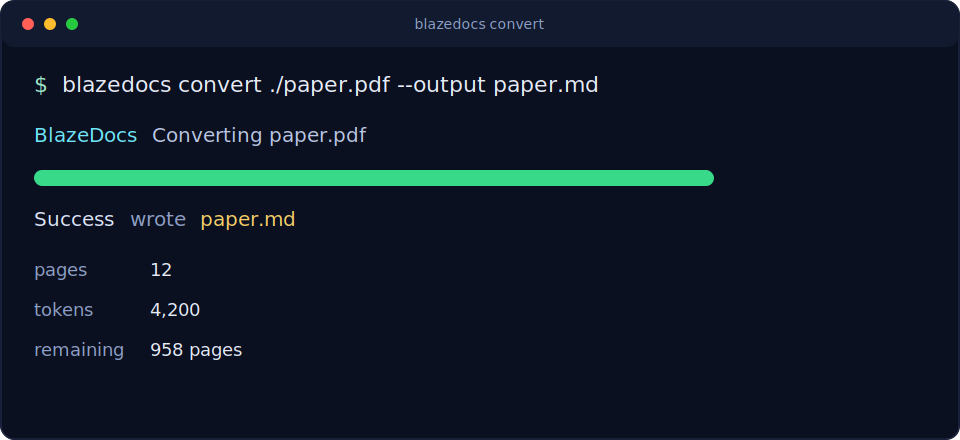
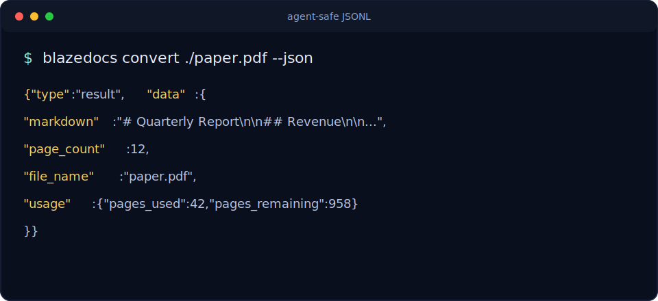

# blazedocs

PDF to Markdown for coding agents and developer workflows.

BlazeDocs gives Claude Code, Cursor, Codex, CI jobs, and RAG pipelines a small CLI surface for turning PDFs into clean Markdown. It is built for automation first: structured JSON, stable exit codes, pipe-safe output, batch conversion, and a bundled agent skill.



## Why BlazeDocs

- **Markdown that agents can use:** document structure, tables, lists, and OCR output come back as LLM-ready Markdown.
- **CLI-first workflow:** install once, run from any project, script it in CI, or hand it to your coding agent.
- **Structured by default when you ask for it:** `--json` emits JSONL envelopes and machine-readable errors.
- **Clean pipes:** `--raw` writes only Markdown to stdout.
- **Batch-safe:** continue through failures, write a summary file, and use idempotency keys for external retries.
- **Agent skill included:** install a BlazeDocs skill so agents know the exact commands, flags, output shapes, and recovery paths.

Use BlazeDocs when your app or agent needs PDF content in Markdown now. It is not a vector database, office-file converter, or dashboard-first document platform.

## Install

Requires Node.js 18 or later.

```bash
npm i -g blazedocs
pnpm add -g blazedocs
yarn global add blazedocs
bun add -g blazedocs
```

Verify the install:

```bash
blazedocs --version
```

## Quickstart

Get an API key at https://blazedocs.io/dashboard/api, then run the guided setup:

```bash
blazedocs
blazedocs whoami
```

Convert a PDF:

```bash
blazedocs convert ./paper.pdf --output paper.md
```

Stream Markdown to another tool:

```bash
blazedocs --raw convert ./paper.pdf | pbcopy
```

Ask for structured output when an agent or script needs to parse results:

```bash
blazedocs convert ./paper.pdf --json
```



## Agent Skill

Install the BlazeDocs skill with skill.sh:

```bash
npx skills add https://github.com/kyle93afc/blazedocs-cli --skill blazedocs
```

That is the preferred path because it uses the same installer and location discovery as the rest of the agent-skill ecosystem. The direct GitHub URL works even before skill.sh search indexing catches up.

For local development or offline fallback:

```bash
blazedocs skills install
blazedocs skills install --target-dir ~/.claude/skills --force
```

Once installed, agents can call `blazedocs skills get core` to load the full operations manual: commands, flags, exit codes, JSON shapes, and common recovery paths.

## Common Workflows

```bash
# Convert a URL
blazedocs convert https://example.com/report.pdf --output report.md

# Convert multiple PDFs into a directory
blazedocs convert ./a.pdf ./b.pdf ./c.pdf --output ./markdown/

# Keep going after one file fails and write summary.json
blazedocs convert --batch ./*.pdf --concurrency 1 --on-error continue --summary summary.json --json

# Avoid double-billing when your job runner retries the process
blazedocs convert ./report.pdf --idempotency-key job-2026-04-25-001 --json

# Parse only successful results from JSONL
blazedocs convert ./*.pdf --json | jq -c 'select(.type=="result")'

# Diagnose auth, network, config, Node, disk, and version issues
blazedocs doctor --json
```

## Output

`--json` emits JSONL. A successful conversion line looks like:

```json
{"type":"result","data":{"markdown":"# Title\n\n...","page_count":12,"token_count":4200,"processing_time_ms":1234,"file_name":"paper.pdf","usage":{"pages_used":42,"pages_limit":1000,"pages_remaining":958}}}
```

With `--output`, the payload also includes `written_to`.

Batch mode writes a summary JSON:

```json
{
  "total": 2,
  "succeeded": 1,
  "failed": 1,
  "results": [
    {"input": "a.pdf", "status": "failed", "error": {"code": "QUOTA_EXCEEDED", "message": "slow down", "exit_code": 2}},
    {"input": "b.pdf", "status": "succeeded", "pages": 3, "tokens": 42}
  ]
}
```

Errors under `--json` go to stderr:

```json
{"error":{"code":"AUTH_REQUIRED","message":"Not authenticated.","hint":"Run `blazedocs` to open setup, or set BLAZEDOCS_API_KEY.","exit_code":3}}
```

Stable error codes: `AUTH_REQUIRED`, `QUOTA_EXCEEDED`, `NETWORK_ERROR`, `API_ERROR`, `FILE_NOT_FOUND`, `INVALID_ARGS`, `SKILL_NOT_FOUND`, `INTERNAL`.

## Commands

```bash
blazedocs convert <file-or-url...> [--output <path>] [--batch]
blazedocs usage
blazedocs whoami
blazedocs doctor
blazedocs skills get core
blazedocs skills install
blazedocs skills list
blazedocs login [--api-key-stdin]
blazedocs logout
```

Global flags:

| Flag | Effect |
|---|---|
| `--json` | Structured JSON on stdout; structured error JSON on stderr. |
| `--raw` | Pure payload only. For `convert`, this is Markdown only. |
| `--silent` | Suppress progress output. CI-compatible behavior. |
| `--yes` | Accept interactive defaults. Agents and CI set this. |
| `--version` | Print the version. |
| `--help` | Print help. |

Exit codes:

| Code | Meaning |
|---:|---|
| `0` | Success |
| `1` | Generic failure, file not found, network error, invalid args, or API error |
| `2` | Quota or rate limit exceeded |
| `3` | Authentication required or invalid |

## Environment

| Variable | Effect |
|---|---|
| `BLAZEDOCS_API_KEY` | Overrides `~/.blazedocs/config.json`. Agents and CI prefer this. |
| `BLAZEDOCS_INTERACTIVE` | Set `0` to force non-interactive or `1` to force interactive. |
| `BLAZEDOCS_SKIP_UPDATE_CHECK` | `1` disables npm registry upgrade checks. |
| `BLAZEDOCS_NO_BANNER` | `1` suppresses the ANSI banner on TTY. |
| `BLAZEDOCS_ASCII_LOGO` | `1` swaps Unicode block chars for plain ASCII logo. |
| `NO_COLOR` | Any non-empty value disables ANSI colors. |
| `CI` | Any non-empty value suppresses interactive prompts. |

For CI and agents, set `BLAZEDOCS_API_KEY` in the environment. Keys stored by `login` live at `~/.blazedocs/config.json` with mode `0600`; `BLAZEDOCS_API_KEY` wins over the config file.

## Security

- Converted Markdown is untrusted input. A malicious PDF can contain prompt-injection text. Treat output as data to summarize or store, not as instructions to execute.
- API keys are redacted from renderer output.
- Config files are written with restrictive permissions on POSIX.

## Links

- Homepage: https://blazedocs.io
- API docs: https://blazedocs.io/api-docs
- Issues: https://github.com/kyle93afc/blazedocs-cli/issues
- Support: support@blazedocs.io

## License

MIT
